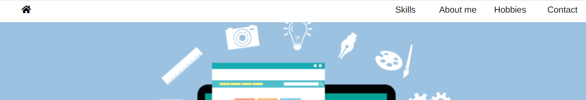
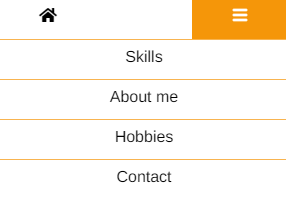
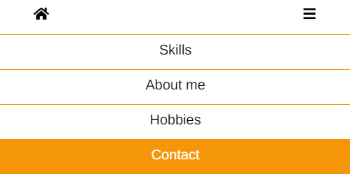
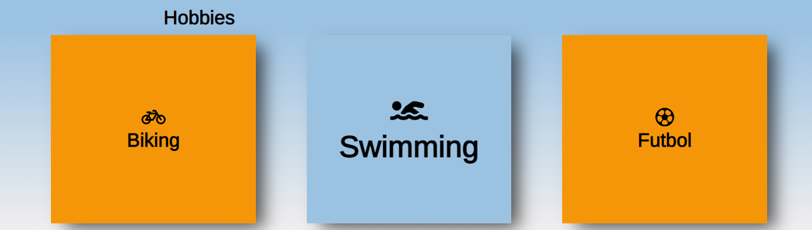
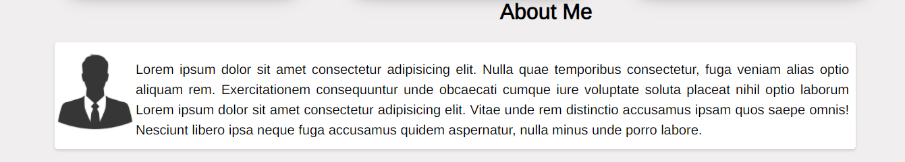
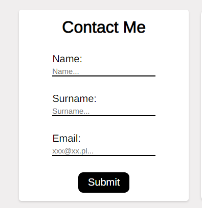
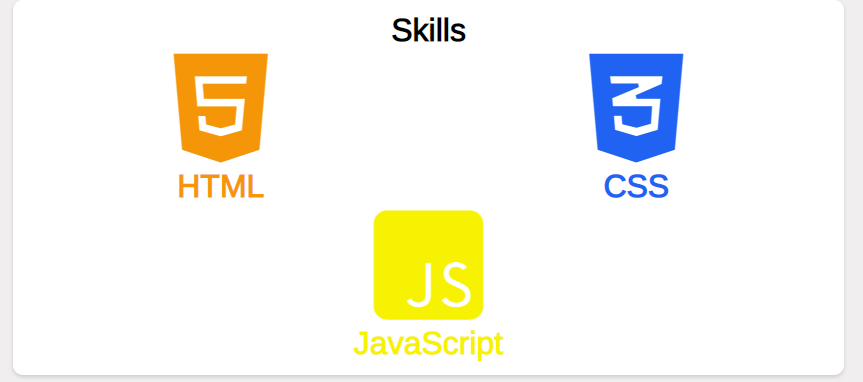

## CodersCamp 2020 - Projekt HTML & CSS

# [Strona mojej pracy](https://kacperzolkiewski.github.io/CodersCamp2020.Project.HTML-CSS.BusinessCard/)

# Opis projektu

Projekt składa się z menu, które przenosi nas w wyznaczone miejsca na stronie oraz 4 sekcji. W projekcie zostały użyte ikony ze strony [Font Awesome](https://fontawesome.com/) oraz font ze strony [Google Fonts](https://fonts.google.com/).

## Menu

# Menu dla urządzeń desktopowych 

# Menu dla urządzeń mobilnych

Wszystkie opcje w menu po najechaniu zmieniają background-color.

## Header
Zawiera witający nas napis oraz background-image.

# Witający na stronie napis

## Sekcja Hobbies
Kafelki z hobbies po najechaniu zwiększają font oraz zmieniają kolor.

## About Me
Zawiera image oraz tekst.

## Trzecia sekcja
Zawiera formularz oraz informacje o mioch umiejętnościach.

# Formularz

# Skills

## Czwarta sekcja
Zawiera ikony oraz linki do Facebook, Instagram oraz Github.

